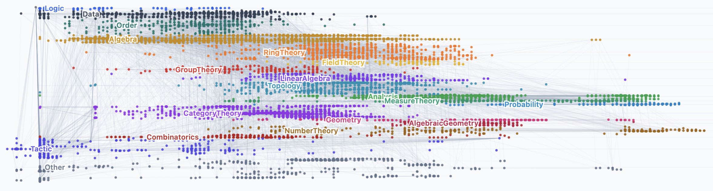
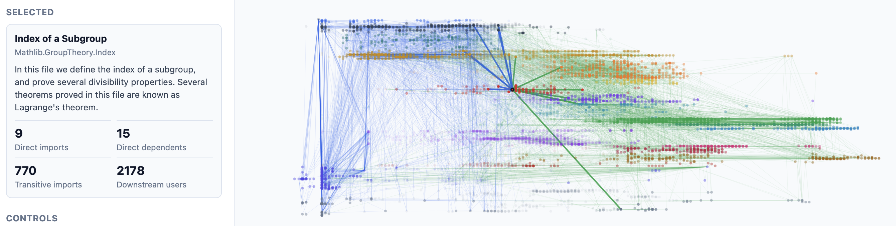
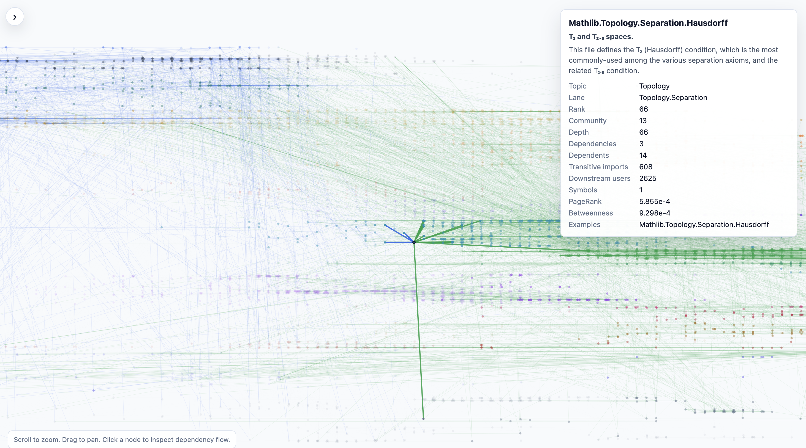
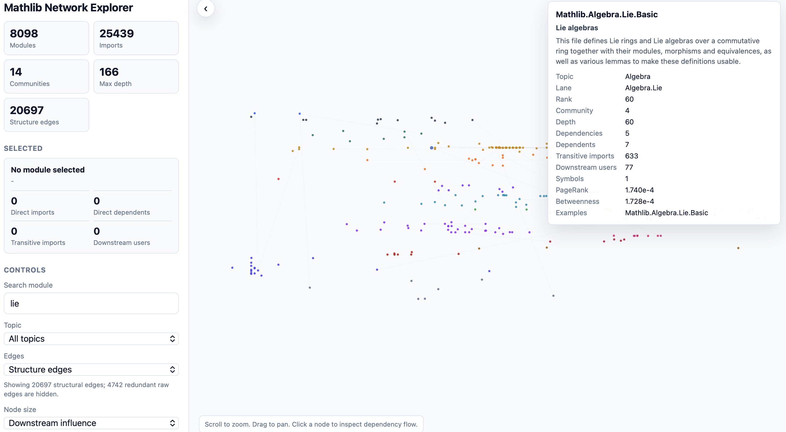

# Mathlib Network Explorer





<p align="center">
  <strong>Mathlib4 数学库的交互式依赖关系图浏览器。</strong>
</p>

<p align="center">
  <a href="https://github.com/leanprover-community/mathlib4">mathlib4</a> ·
  <a href="README.md">English Docs</a>
</p>

---

本项目是 [Crispher/MathlibExplorer](https://github.com/Crispher/MathlibExplorer) 的开源复现，
数据来源于 [leanprover-community/mathlib4](https://github.com/leanprover-community/mathlib4)。
项目保留了原工具的核心设计：依赖感知的水平布局、主题分组、缩放/平移导航、节点高亮以及预计算的图指标。

主数据路径使用本地 `leanprover-community/mathlib4` 源码快照，静态解析 `Mathlib/**/*.lean` 的
import 声明。Hugging Face 数据集 `phanerozoic/Lean4-Mathlib` 作为定理和符号级别的补充，
sample fixture 保证测试可离线运行。

## 快速开始

运行完整离线演示：

```bash
make all
```

该命令使用 `data/sample/lean4_mathlib_sample.jsonl`，生成：

- `data/processed/nodes.csv`
- `data/processed/edges.csv`
- `data/processed/graph.json`
- `data/processed/metrics.json`
- `figures/*.png`
- `docs/index.html`
- `report/mathlib-network-report.pdf`
- `outputs/mathlib-network-demo.mp4`

运行完整的 Mathlib 模块导入网络：

```bash
make mathlib-source
make data DATA_SOURCE=mathlib-source
make analyze web report video
```

有网络时使用 Hugging Face 数据集：

```bash
make data DATA_SOURCE=hf
make analyze web report video
```

更快的真实数据冒烟测试，限制 Dataset Viewer 回退行数：

```bash
make data DATA_SOURCE=hf HF_ROW_LIMIT=1000
make analyze web report video
```

当前本地 `pyarrow` 构建可能在读取 Hugging Face 生成的 Parquet 分片时出现
repetition-level 错误。下载器会记录 Parquet 元数据，然后自动回退到 Hugging Face
Dataset Viewer rows API。`HF_ROW_LIMIT=0` 表示通过回退方式获取全部行；
全量拉取可能较慢，因为 API 每页 100 行。

如果已有本地 Parquet/CSV/JSONL 导出：

```bash
make data DATA_SOURCE=file RAW_INPUT=/absolute/path/to/export.parquet
```

## 可视化说明

`docs/index.html` 是依赖最少的交互式演示。侧边栏可通过图角落的圆形按钮折叠以获取更宽的视图。

导入方向决定水平位置：越靠右的模块依赖越深。主题/命名空间通道在垂直方向分隔主要数学领域，
弱力精调防止局部邻域坍缩到同一行。

点击节点可高亮直接邻居、传递依赖和传递被依赖：

- 直接 import 边显示为蓝色，直接被依赖边显示为绿色。
- 传递关系以更弱的颜色保留。
- 无关节点和边被淡化。

默认边视图展示传递约简骨架。原始导入模式恢复所有源导入边，
仅选中模式聚焦当前选中模块的局部流。

详细节点信息与依赖关系。



Lie 群节点搜索与局部邻域探索。



## 项目结构

- `scripts/`：数据提取、分析、图表、报告和视频构建脚本
- `scripts/mathlib_graph/`：可复用的图管线包
- `web/`：TypeScript + Vite + Sigma.js/Graphology 前端脚手架
- `docs/`：静态交付物和项目笔记
- `data/sample/`：离线 fixture
- `data/raw/`：[leanprover-community/mathlib4](https://github.com/leanprover-community/mathlib4) 仓库源码
- `data/processed/`：生成的图数据
- `figures/`、`report/`、`outputs/`：产出物
- `tests/`：离线单元测试

## 主要命令

```bash
make mathlib-source # 下载 mathlib4 源码快照
make data           # 构建 nodes.csv、edges.csv、graph.json、metrics.json
make analyze        # 生成结果图表
make web            # 构建 docs/index.html 静态交互页面
make web-vite       # 构建 Vite/Sigma 前端（需 npm 依赖）
make report         # 构建中文 PDF 报告
make video          # 生成 MP4 演示短片
make test           # 运行离线测试
make all            # 完整产出管线
```

## 数据模型

稳定的生成文件：

- `nodes.csv`：每行一个模块，含中心性、社区、深度、布局和主题字段。
- `edges.csv`：每行一条导入关系，`source imports target`。
- `graph.json`：前端就绪的图数据。
- `metrics.json`：计数、校验检查和 Top 分析结果。
